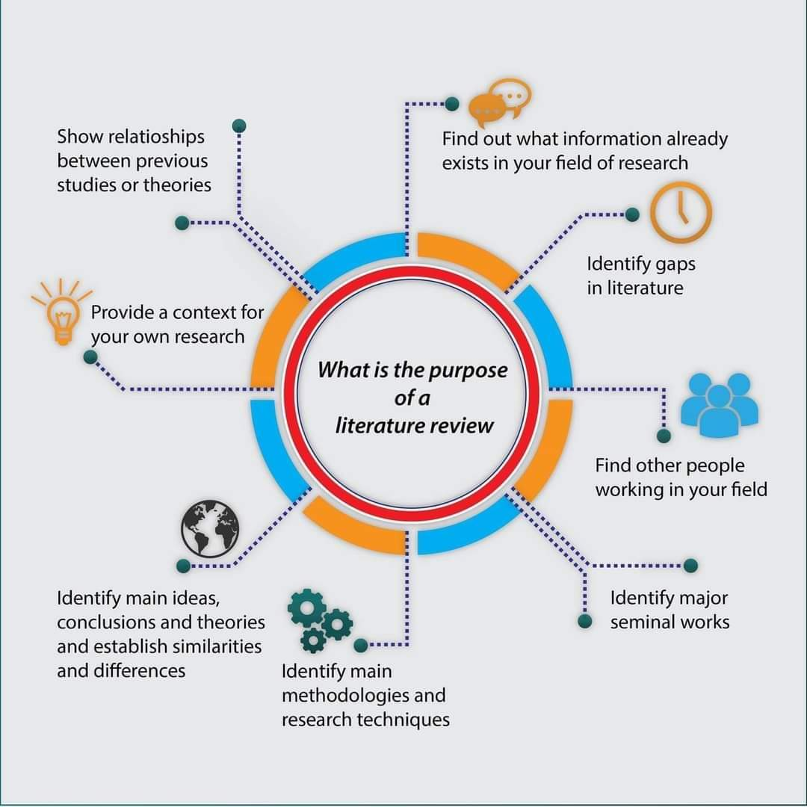
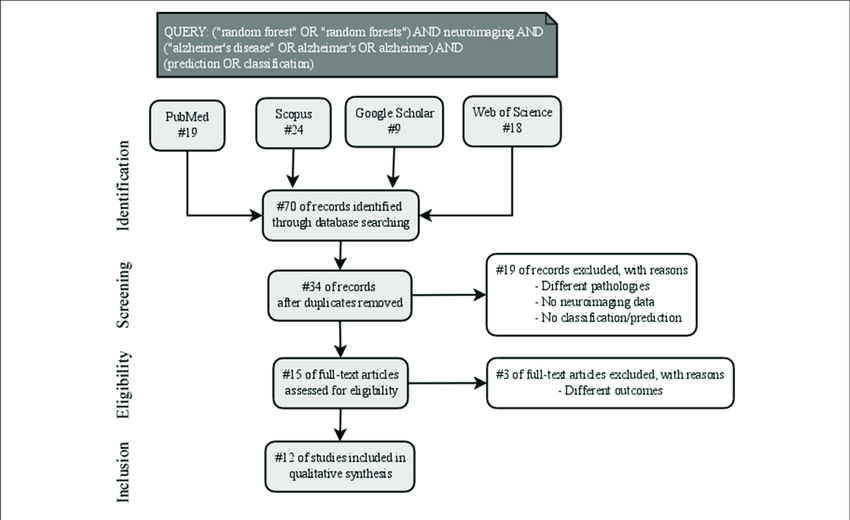
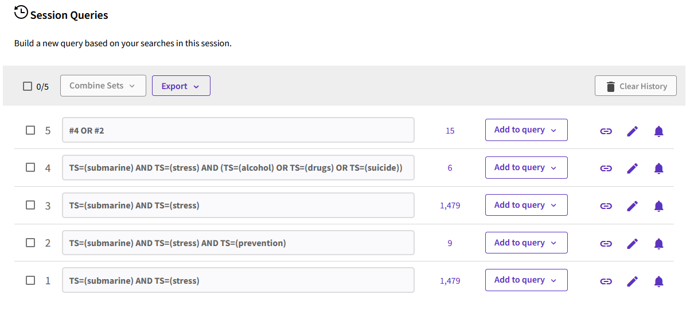
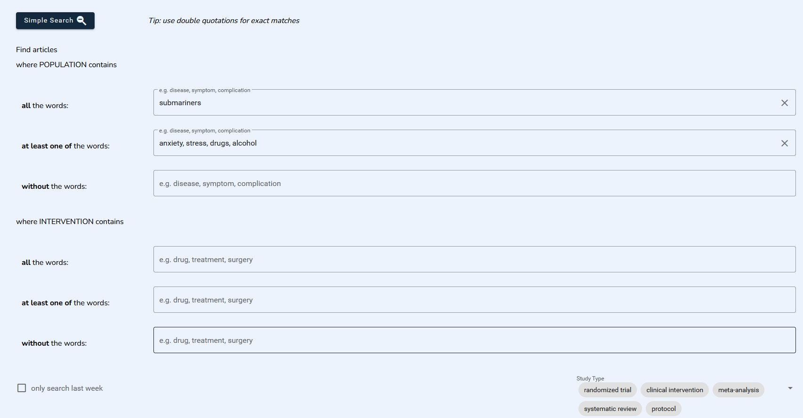

# Revue de littérature / méta-analyse

> Une méta-analyse est une synthèse quantitative exhaustive et reproductible des résultats des études étudiant la même question.

##

- Augmenter la puissance statistique de la recherche
- Améliorer la précision de l’estimation de l’effet traitement
- Lever le doute en cas de résultats discordants

##

Une méta-analyse est plus qu’une revue systématique, **qui fait la même chose sans la synthèse quantitative.**

## intérêts de la revue de littérature

## La méthode PRISMA

1. écrire un protocole, le rendre accessible (par exemple sur [prospero](https://www.crd.york.ac.uk/PROSPERO/)
2. Définir des critères d'éligibilité
3. Décrire les bases, corpus d'articles dans lesquels on a trouvé les études pertinentes
4. stratégie de recherche : définir cette stratégie et conserver les équations de recherche
5. processus de sélection : décrire les étapes (et les acteurs) de cette sélection

## La méthode PRISMA 

6. extraction des données (pas pertinent pour les revues systématiques)
7. Risque de biais (dans la sélection des sources)

# PICOS {.nonincremental}

**P**opulation  
**I**ntervention  
**C**omparison  
**O**utcome  
**S**tudy design  

# PICOS {.nonincremental}

**P**opulation de San Francisco  
**I**: ajout de fluor dans l'eau potable  
**C**: pas d'ajout  
**O**: prévention de la carie dentaire  
**S**: études de cohortes  

## Plusieurs bases de données

## Exercice 

::::{.columns}
:::{.column width="50%"}

Quelle stratégie pour prévenir l'apparition de stress et de conduites addictives (drogue, alcool) dans un sous-marin en temps de paix (longues campagnes)

Proposer des mots-clé sous la forme d'un diagramme PICO 
:::
:::{.column width="50%"}

:::
::::

# PICOS

**P**: sous-mariniers en temps de paix   
**I**:   
**C**:   
**O**: prévention des addictions liées au stress  
**S**:   

## Pubmed (MeSH)

`("Military Personnel/psychology"[Mesh]) AND ("Submarine Medicine"[Mesh]) AND stress`

n=7

## Web Of Science

``TS=(submarine) AND TS=(stress)``
n=1479

``TS=(submarine) AND TS=(stress) AND TS=(prevention)``
n=9

``TS=(submarine) AND TS=(stress) AND (TS=(alcohol) OR TS=(drugs) OR TS=(suicide))``

n=6

## Web of Science (combinaison)

## Embase 

``('military medicine'/exp OR 'military medicine') AND ('stress'/exp OR stress) AND submarin*``

## OpenAlex

https://openalex.org/works?sort=cited_by_count%3Adesc&column=display_name,publication_year,type,open_access.is_oa,cited_by_count&page=1&filter=concepts.id%3AC121327165%2BC70410870

## Cochrane

|ID | Search | Hits |
|:--|:--|:--|  
| #1 | ("submariner"):ti,ab,kw AND (stress):ti,ab,kw | 0 |  
| #2 | submariners | 7 |
| #3 | submarine* AND stress | 6 |
| #4 | submarine* AND mental health | 4 |
| #5 | #3 OR #4 | 8 |

## EvidenceHunt (IA)

# Usage de Zotero

## Utiliser les fonctionnalités de Zotero

- gestion des métadonnées  
- collections et sous-collections  
- dédoublonnage   
- marqueurs  
